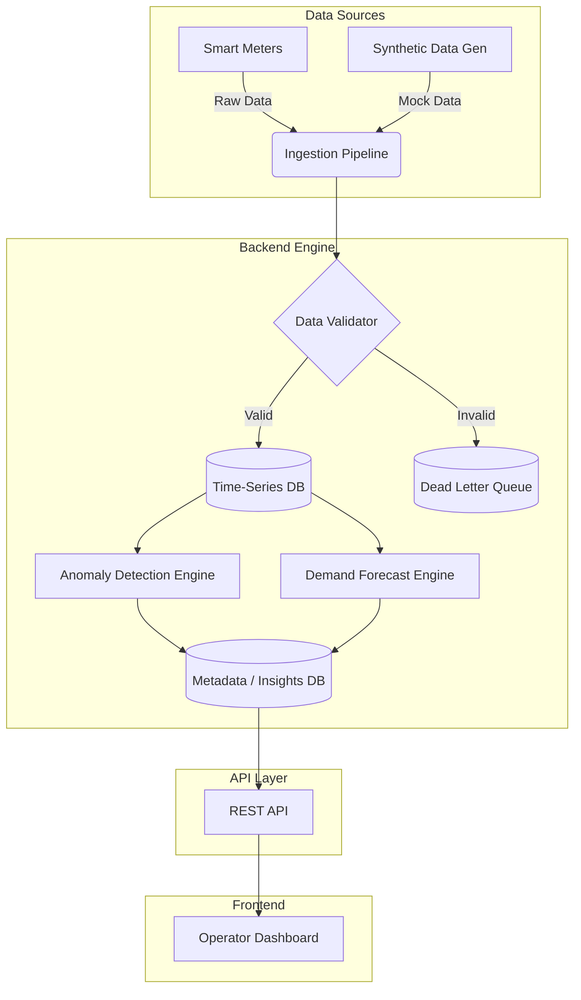

# System Architecture

WattWatch is designed with a modular, decoupled architecture. This allows for incremental development by a single developer—starting with simple rule-based scripts and scaling up to complex ML microservices.

## 1. High-Level Architecture Diagram

## 2. Component Details

### 2.1. Ingestion Pipeline
- **Role:** Collects incoming smart meter readings (15-min or hourly intervals).
- **Implementation:** Initially a simple cron-job reading CSV files. Can scale to Apache Kafka/RabbitMQ.

### 2.2. Data Validator
- **Role:** Enforces the [Data Contract](DATA_CONTRACT.md). Rejects malformed or impossible readings (e.g., negative consumption).

### 2.3. Storage Layer
- **Time-Series DB:** Stores historical meter readings optimized for temporal queries. (e.g., TimescaleDB, InfluxDB, or simply SQLite/DuckDB for MVP).
- **Insights DB:** Relational database storing anomaly flags, confidence scores, explanations, and audit trails. (e.g., PostgreSQL or SQLite).

### 2.4. Inference Engines
- **Anomaly Detection:** Scans recent data windows against historical baselines and peer groups to flag unusual behavior.
- **Demand Forecast:** Generates day-ahead predictions based on historical averages and recent trends.

### 2.5. API Layer
- **Role:** Exposes endpoints for the dashboard to fetch forecasts, anomaly queues, and submit human reviews.
- **Stack:** Lightweight framework (e.g., FastAPI or Express).

### 2.6. Operator Dashboard
- **Role:** The UI for human-in-the-loop review.
- **Stack:** Modern web framework (e.g., React, Next.js) using charting libraries (Recharts, Chart.js) for visualization.

## 3. Design Principles
- **API-First:** The backend and frontend are entirely decoupled.
- **Stateless Engines:** The inference engines pull data, compute, and push results. They hold no internal state between runs.
- **Auditability:** Every record in the Insights DB contains a `justification` field explaining why it was flagged.
